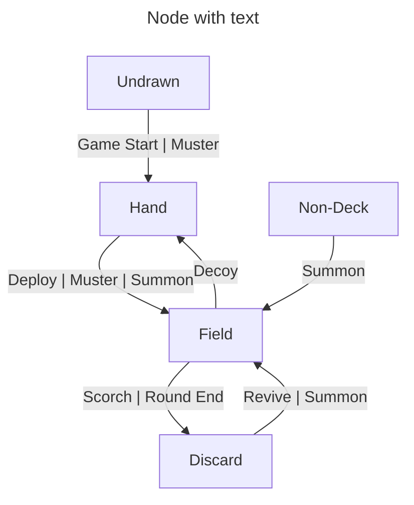

# Game Card Flow

"Deployment by a game player to the battlefield."
DEPLOY
"Mustered when matching Muster unit added to battlefield."
MUSTER
"Revived by Medic added to battlefield."
REVIVE
"Summoned when matching Avenger unit removed from battlefield."
SUMMON
"Transformed when Mardroeme unit added to battlefield row."
TRANSFORM

