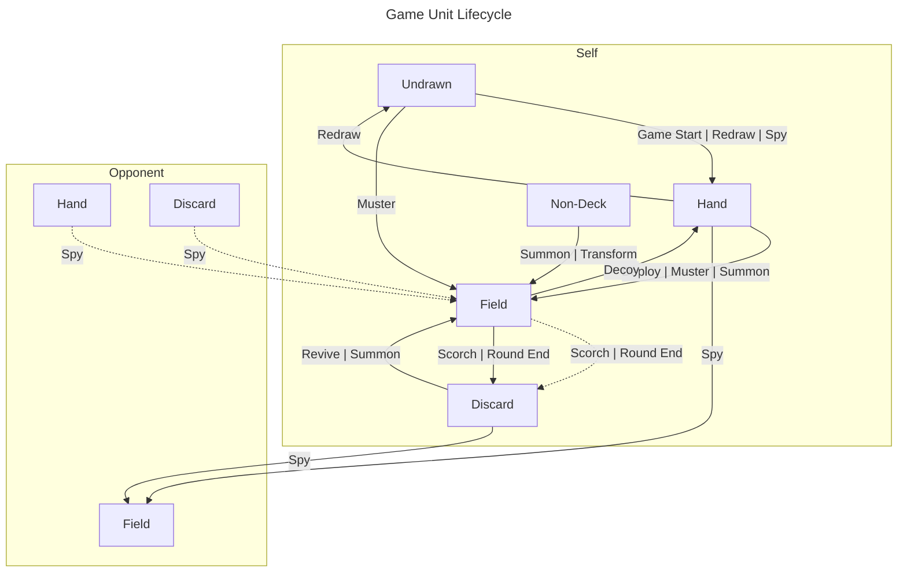

# Game Unit Lifecycle

The potential lifecycle routes of a Unit during a Game.

Dotted lines denote opponent actions.

```mermaid
---
title: Game Unit Lifecycle
---
flowchart TB
  subgraph Self
    direction TB
    undrawn[Undrawn] --> |Game Start #124; Redraw #124; Spy| hand[Hand]
    undrawn --> |Muster| field[Field]
    hand --> |Redraw| undrawn
    hand --> |Deploy #124; Muster #124; Summon | field[Field]
    field --> |Decoy| hand
    nonDeck[Non-Deck] --> |Summon #124; Transform| field[Field]
    field -.-> |Scorch #124; Round End| discard
    field --> |Scorch #124; Round End| discard[Discard]
    discard --> |Revive #124; Summon| field
  end
  subgraph Opponent
    direction TB
    opponentHand[Hand] -.-> |Spy| field[Field]
    hand --> |Spy| opponentField[Field]
    discard --> |Spy| opponentField[Field]
    opponentDiscard[Discard] -.-> |Spy| field[Field]
  end
```
