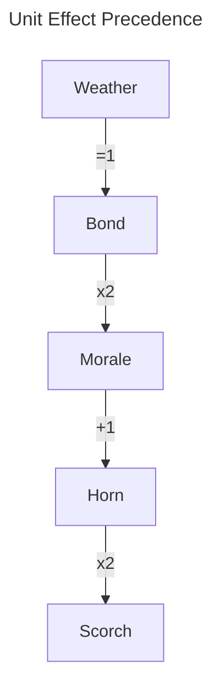

# Unit Effect Precedence

The order that Effects are applied to a Unit. Heroes are immune.

```mermaid
---
title: Unit Effect Precedence
---
flowchart TB
  weather[Weather] --> |=1| bond[Bond]
  bond[Bond] --> |x2| morale[Morale]
  morale[Morale] --> |+1| horn[Horn]
  horn[Horn] --> |x2| scorch[Scorch]
```
